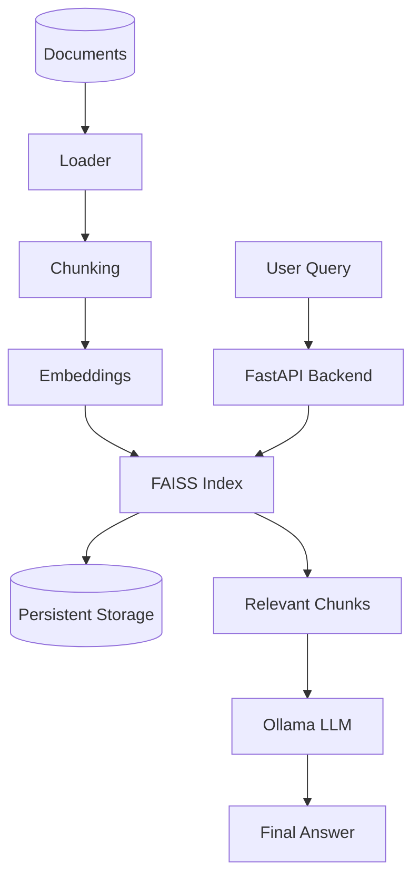
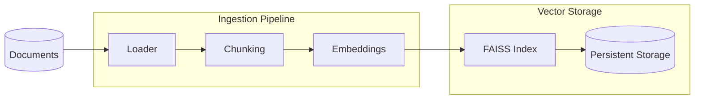
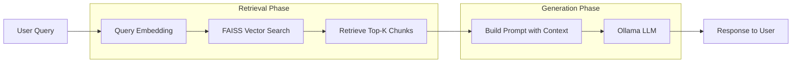
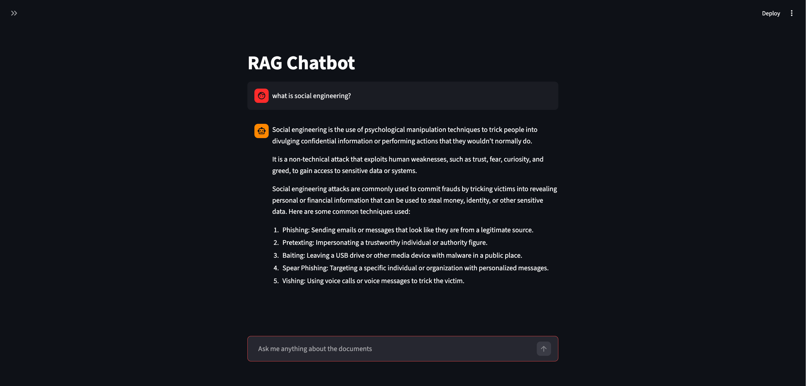
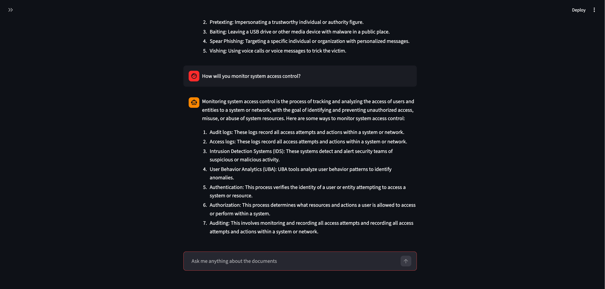
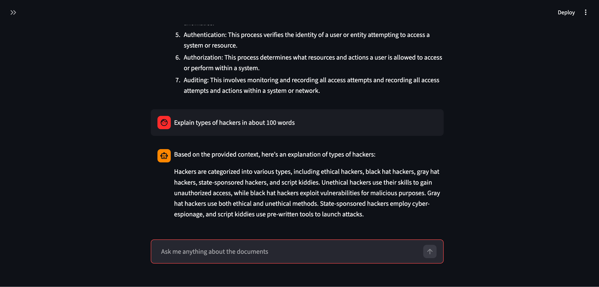
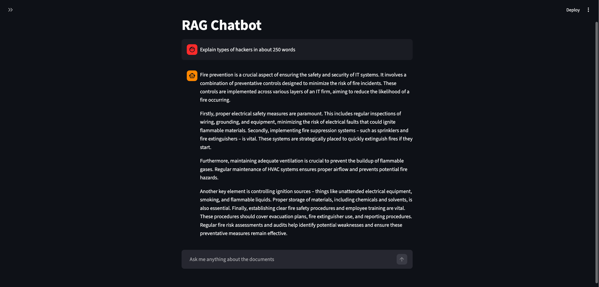
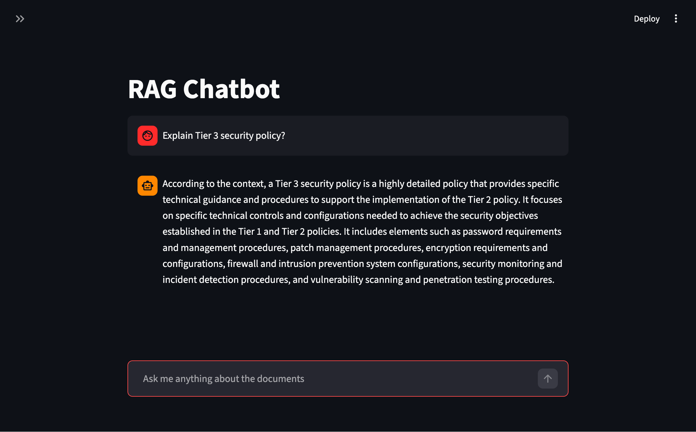
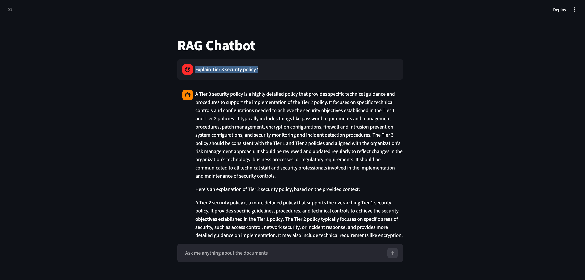
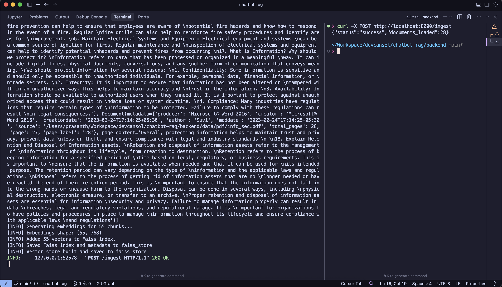

# Domain-Specific RAG Chatbot Application

[Python](#)
[FastAPI](#)
[Ollama](#)

A complete **Retrieval-Augmented Generation (RAG) chatbot** built with FastAPI, FAISS, Ollama, and Streamlit. The system ingests documents, builds a semantic vector index, retrieves relevant content for user queries, and generates grounded responses using a local LLM.

This repository contains:

- Backend API for ingestion, vector search, and answer generation
- Frontend Streamlit UI for interactive chat
- Persistent vector database using FAISS
- Local LLM inference using Ollama

# Overview

This chatbot answers questions using your own documents.

Instead of relying only on the LLM's knowledge, it:

1. Loads and chunks documents
2. Converts chunks into embeddings
3. Stores embeddings in FAISS
4. Retrieves relevant chunks when a user asks a question
5. Sends retrieved context to the LLM
6. Returns a grounded answer

This reduces hallucinations and ensures answers come from your data.

---

# Features

## Core Features

- Document ingestion (PDF, TXT, MD)
- Persistent vector database using FAISS
- Context-aware answers using RAG
- Local LLM support using Ollama
- Semantic search using embeddings
- FastAPI backend API
- Streamlit frontend chat UI

## Performance Features

- Persistent index (no re-embedding on restart)
- Greeting detection without LLM calls
- Configurable chunk size, overlap, and retrieval count
- Low-latency local inference

## Extensible Design

- Modular pipeline
- Support for multiple LLMs
- Easy integration with web or mobile apps

---

# Architecture and Data Flow

## High-Level Architecture of Full Application




---

## Detailed Flow

### Ingestion Flow




### Chat Flow




---

# Tech Stack

## Backend

- FastAPI
- LangChain
- FAISS
- Ollama
- Python 3.13+

## Frontend

- Streamlit
- HTTPX
- Python

## Models

- Embedding model: `nomic-embed-text`
- Chat models: `gemma3:1b`

---

# Project Structure

```
project-root/
│
├── backend/
│   ├── app.py
│   ├── main.py
│   ├── requirements.txt
│   ├── README.md
│   ├── data/
│   ├── faiss_store/
│   └── src/
│       ├── api/
│       ├── services/
│       └── settings/
│
├── frontend/
│   ├── main.py
│   ├── api_client.py
│   ├── requirements.txt
│   └── README.md
│
└── README.md   ← (this file)
```

---

# Setup Instructions

## 1. Install Ollama

Download:

[https://ollama.com/download](https://ollama.com/download)

Start Ollama:

```bash
ollama serve
```

Pull models:

```bash
ollama pull nomic-embed-text
ollama pull gemma3:1b
```

---

## 2. Backend Setup

Navigate to backend:

```bash
cd backend
```

Install dependencies:

Using uv:

```bash
uv sync
```

or pip:

```bash
pip install -r requirements.txt
```

Create .env file:

```
OLLAMA_CHAT_MODEL=gemma3:1b
OLLAMA_EMBEDDING_MODEL=nomic-embed-text
OLLAMA_HOST=http://localhost:11434
```

Add documents(pdfs):

```
backend/data/
```

Run backend:

```bash
uv run uvicorn app:app --reload
```

Backend runs at:

```
http://localhost:8000
```

Swagger docs:

```
http://localhost:8000/docs
```

---

## 3. Build Vector Index

Call ingest endpoint:

```
POST http://localhost:8000/ingest
```

Or using curl:

```bash
curl -X POST http://localhost:8000/ingest
```

This creates:

```
backend/faiss_store/
```

---

## 4. Frontend Setup

Navigate to frontend:

```bash
cd frontend
```

Install dependencies:

```bash
uv sync
```

or

```bash
pip install -r requirements.txt
```

Create .env file:

```
BACKEND_URL=http://localhost:8000
```

Run frontend:

```bash
streamlit run main.py
```

Frontend runs at:

```
http://localhost:8501
```

---

# Usage

1. Start Ollama
2. Start Backend
3. Run Ingest API
4. Start Frontend
5. Ask questions in UI

---

# API Reference

## Health Check

```
GET /health
```

Response:

```json
{
  "status": "ok"
}
```

---

## Chat

```
POST /chat
```

Request:

```json
{
  "query": "What is network security?",
  "top_k": 5
}
```

Response:

```json
{
  "answer": "Network security protects systems...",
  "sources": [],
  "metadata": []
}
```

---

## Ingest

```
POST /ingest
```

Response:

```json
{
  "status": "success",
  "documents_loaded": 42
}
```

---

# Design Decisions

## FAISS for Vector Storage

Reason:

- Lightweight
- Fast similarity search
- No external database required
- Easy persistence

---

## Ollama for LLM and Embeddings

Reason:

- Runs locally
- No API cost
- Model flexibility
- Privacy preserving

---

## Context-Only Prompting

Reason:

- Prevent hallucination
- Ensure grounded answers
- Increase reliability

---

## Modular Architecture

Benefits:

- Easy to extend
- Easy to replace components
- Supports scaling

---

# Potential Improvements

## Functional Improvements

- Conversation memory
- Multi-user sessions
- Document upload via API
- Source citation with page numbers
- Incremental indexing
- Streaming responses
- Hybrid search (keyword + vector)

---

## Performance Improvements

- Caching embeddings
- Batch inference
- Distributed vector database

---

## Production Improvements

- Authentication
- Docker support
- Cloud deployment
- Monitoring and logging 
- Autoscaling

---

# Screenshots and Examples

### Example Questions and Chat UI

<p align="center">
  
  <br/>
  <em>Chat interface showing a sample user question and generated answer.</em>
</p>

<p align="center">
  
  <br/>
  <em>Chatbot answering additional domain-specific queries.</em>
</p>

---

### Document Chunking Examples

<p align="center">
  
  <br/>
  <em>Example query with approximately 100 words</em>
</p>

<p align="center">
  
  <br/>
  <em>Example query with approximately 250 words.</em>
</p>

---

### Chunk Size Comparison

<p align="center">
  
  <br/>
  <em>Retrieval results using 1024 token chunk size.</em>
</p>

<p align="center">
  
  <br/>
  <em>Retrieval results using 4096 token chunk size.</em>
</p>

---

### Ingestion Pipeline

<p align="center">
  
  <br/>
  <em>Document ingestion pipeline showing loading, chunking, embedding, and indexing into FAISS.</em>
</p>
---

# Deliverables Included

- Working chatbot application
- Full backend and frontend source code
- Persistent vector store
- Interactive UI
- Complete documentation
- Extensible modular architecture

